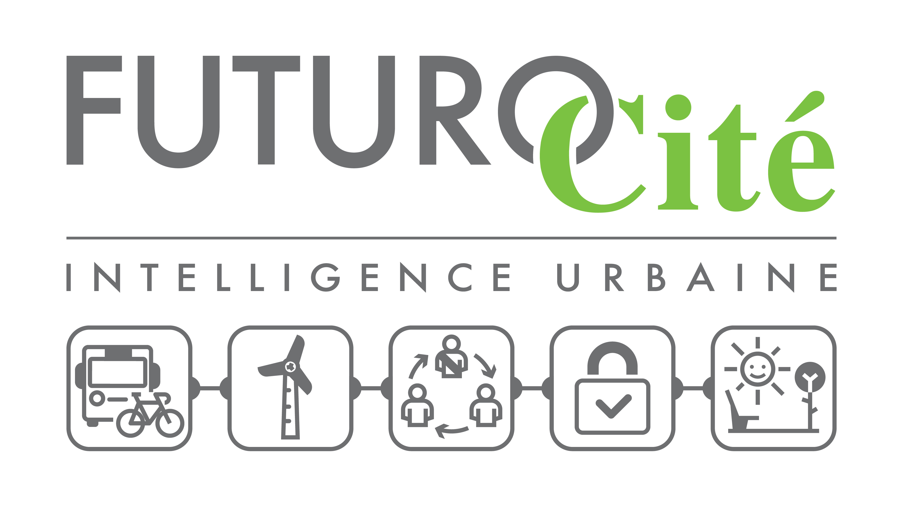

# Programme "Ouvrir ma ville"

## Webinaires : saison 2

### Mardi 12 janvier 2021 de 09h30 à 11 heures : *documenter et améliorer la qualité des données*
* **Intervenant** : [Sylvain Lapoix (Datactivist)](http://twitter.com/sylvainlapoix)
* **Lieu** : sur [Zoom](https://zoom.us/j/99688455700).
* **Support** : [Documenter et améliorer la qualité des données](https://datactivist.coop/futurocite_ouvrir-ma-ville/qualite_donnees)

### Mardi 19 janvier 2021 de 09h30 à 11 heures : *trois histoires de l'open data local*
* **Intervenant** : [Sylvain Lapoix (Datactivist)](http://twitter.com/sylvainlapoix)
* **Lieu** : sur [Zoom](https://zoom.us/j/98930345295) aussi !
* **Support** : - à venir -

### Mercredi 3 février 2021 de 10h30 à 12 heures : *datavisualisation et communication avec les habitant·es*
* **Intervenant** : encore [Sylvain Lapoix (Datactivist)](http://twitter.com/sylvainlapoix) !
* **Lieu** : sur Gather.town cette fois-ci (instance en cours de construction) / en parallèle du hackathon [Hack your city](http://www.futurocite.be/hack-your-city/) ;
* **Support** : - à venir -
